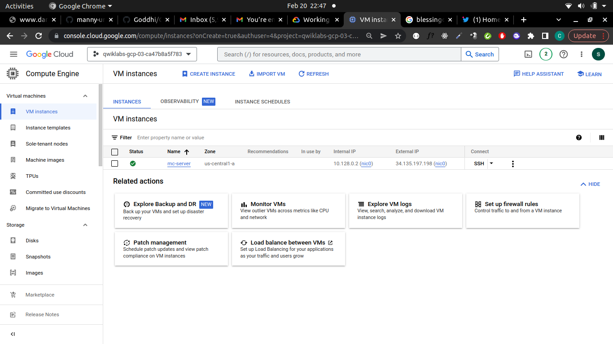

# Deployed Minecraft Game Server on Compute Engine

### Overview
- The Minecraft server software will run on a Compute Engine instance.

-  An e2-medium machine type that includes a 10-GB boot disk, 2 virtual CPU (vCPU), and 4 GB of RAM. This machine type runs Debian Linux by default.

- To make sure there is plenty of room for the Minecraft server's world data, you also attach a high-performance 50-GB persistent solid-state drive (SSD) to the instance. This dedicated Minecraft server can support up to 50 players.

## Objectives

- Customize an application server

- Install and configure necessary software

- Configure network access

- Schedule regular backups

### Step 1. Create the VM
- Login into GCP web console
- In the Cloud Console, on the Navigation menu (Navigation menu), click Compute Engine > VM instances.
- Click Create Instance.
- Specify the following and leave the remaining settings as their defaults:
Name : mc-server
Region : us-central1
Zone : us-central1-a
Boot disk : Debian GNU/Linux 11 (bullseye)
Identity and API access > Access scopes	: Set access for each API
Storage : Read Write

- Click Advanced options.
- Click Disks. You will add a disk to be used for game storage.
- Click Add new disk.
- Specify the following and leave the remaining settings as their defaults:

Name : minecraft-disk
Disk type : SSD Persistent Disk
Disk Source type : Blank disk
Size(GB) : 50
Encryption : Google-managed encryption key

- Click Save. This creates the disk and automatically attaches it to the VM when the VM is created.

- Click **Networking**.

- Specify the following and leave the remaining settings as their defaults:

Network tags : minecraft-server
Network Interfaces : Click **default** to edit the interface
External IPv4 address	: Create IP Address
Name : mc-server-ip

- click **Reserve**
- click **Done**
- click **Create**




### Step 2. Prepare the data disk

##### Create a directory and format and mount the disk

The disk is attached to the instance, but it is not yet mounted or formatted.


- For **mc-server**, click **SSH** to open a terminal and connect.

- To create a directory that serves as the mount point for the data disk, run the following command:
```
sudo mkdir -p /home/minecraft
```
- check the attached disk using the follow command
```
lsblk
```

- To format the disk, run the following command:
```
sudo mkfs.ext4 -F -E lazy_itable_init=0,\
lazy_journal_init=0,discard \
/dev/disk/by-id/google-minecraft-disk
```

- To mount the disk, run the following command:
```
sudo mount -o discard,defaults /dev/disk/by-id/google-minecraft-disk /home/minecraft
```
- Verify if the disk has been mounted using the command bellow
```
df -h
```
### Task 3. Install and run the application

The Minecraft server runs on top of the Java Virtual Machine (JVM), so it requires the Java Runtime Environment (JRE) to run. Because the server doesn't need a graphical user interface, you use the headless version of the JRE. This reduces the JRE's resource usage on the machine, which helps ensure that the Minecraft server has enough room to expand its own resource usage if needed.

##### Install the Java Runtime Environment (JRE) and the Minecraft server

- In the SSH terminal for **mc-server**, to update the Debian repositories on the VM, run the following command:
```
sudo apt-get update
```
- After the repositories are updated, to install the headless JRE, run the following command:
```
sudo apt-get install -y default-jre-headless
```
- To navigate to the directory where the persistent disk is mounted, run the following command:
```
cd /home/minecraft
```
- To install wget, run the following command:
```
sudo apt-get install wget
```
- If prompted to continue, type **Y**.

- To download the current Minecraft server JAR file (1.11.2 JAR), run the following command:
```
sudo wget https://launcher.mojang.com/v1/objects/d0d0fe2b1dc6ab4c65554cb734270872b72dadd6/server.jar
```

### Initialize the Minecraft server
- To initialize the Minecraft server, run the following command:
```
sudo java -Xmx1024M -Xms1024M -jar server.jar nogui
```
**Note**: The Minecraft server won't run unless you accept the terms of the End User Licensing Agreement (EULA).

- To see the files that were created in the first initialization of the Minecraft server, run the following command:
```
sudo ls -l
```
**Note**: You could edit the server.properties file to change the default behavior of the Minecraft server.

- To edit the EULA, run the following connand
```
sudo nano eula.txt
```
- Change the last line of the file from eula=false to eula=true.
- Press Ctrl+O, ENTER to save the file and then press Ctrl+X to exit nano.
- **Note**: Don't try to restart the Minecraft server yet. You use a different technique in the next procedure..


